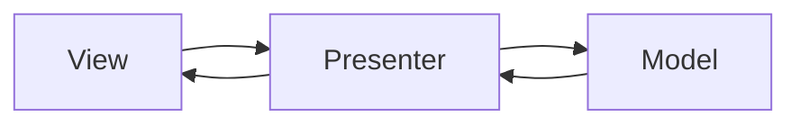

## 2-4 MVVM模式
MVP模式  
M：数据层  
V：视图层  
P：呈现层，控制层

```mermaid
graph LR
View-->Presenter
Presenter-->View
Presenter-->Model
Model-->Presenter
```

MVVM模式  
M：数据层  
V：视图层  
VM：ViewModel层

img

## 3-1 Vue实例
v-on:click = @click  

## 3-2 Vue实例生命周期函数
生命周期函数就是vue实例再某一个时间点会自动执行的函数

img

